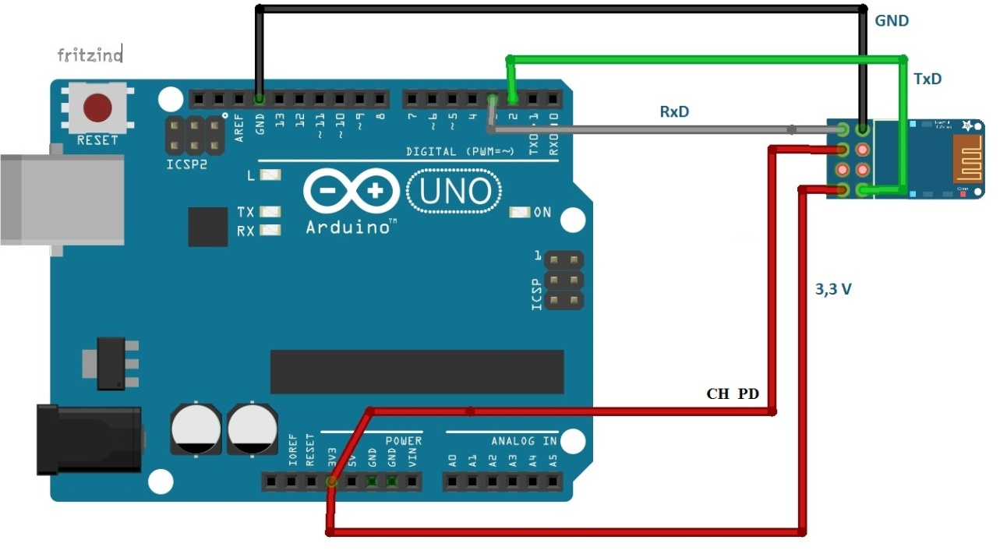

# Using guide of ESP8266

## Connection

## AT command

| AT comand                                           | Usage                                                        |
| --------------------------------------------------- | ------------------------------------------------------------ |
| AT+CWMOD=2                                          | 开启AP模式(被别人连)                                         |
| AT+CWMOD=1                                          | 开启station模式(连别人)                                      |
| AT+CWMODE?                                          | 查询工作模式，3为前两种模式共存                              |
| AT+CWSAP=“ESP8266”,“0123456789”,11,0                | 设置模块的 wifi 和密码                                       |
| AT+CIPSERVER=1,8899                                 | 设置模块服务器端口                                           |
| AT+CIPSEND=0,11                                     | 进入数据发送模式为11个字节                                   |
| AT+CWMODE=1                                         | 设置模组为STA模式                                            |
| AT+CWLAP                                            | 查询附近 WIFI                                                |
| AT+CWJAP=“123123”,“12345678”                        | 连接 WIFI                                                    |
| AT+CIFSR                                            | 查看路由器分配给模组的IP地址                                 |
| AT+CIPMUX=0                                         | 打开单连接                                                   |
| AT+CIPMUX=1                                         | 打开多连接                                                   |
| AT+CIPMODE=1                                        | 设置透传模式                                                 |
| AT+CIPSTART=“TCP”,“192.168.43.104”,8899             | 连接手机端建立的TCP服务器                                    |
| AT+CIPSEND                                          | 开始发送数据                                                 |
| +++                                                 | 注意退出透传，直接发送。取消发送新行                         |
| AT+CIPSTART=0,“UDP”,“255.255.255.255”,50000,1000, 0 | 是建立 UDP 连接，其中手机 UDP server 设置 50000，UDP client 设置的端口 1000 |
| AT+CIPSTART=“UDP”,“192.168.43.104”,5000,2000,0      | 连接网络调试助手UDP的IP和端口                                |
| AT+CIOBAUD=9600                                     | 设置波特率为9600(我的提示error)                              |
| AT+UART=9600,8,1,0,0                                | 设置波特率为9600(这个可以)                                   |

