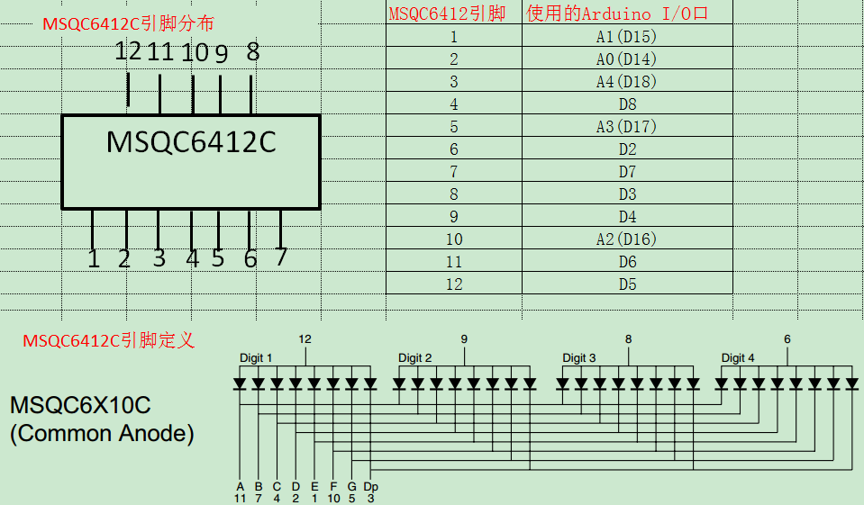

# MSQC6412C Guidence

12 -> 第一位

11 -> 第一横

10 -> 左上竖

9 -> 第二位

8 -> 第三位

7 -> 上竖

6 -> 第四位

5 -> 第二横

4 -> 下竖

3 -> 所有点

2 -> 第三横

1 -> 左下竖

四位数字：12、9、8、6

横：11、5、2

竖：左上10、左下1、右上7、右下4

点：3

*// four bit digit*

*#define* FIR 5 *// 12*

*#define* SEC 4 *// 9*

*#define* THR 3 *// 8*

*#define* FOU 2 *// 6*

*// row*

*#define* RU 8 *// 11*

*#define* RM 7 *// 5*

*#define* RD 6 *// 2*

*// column*

*#define* CLU 12 *// 10*

*#define* CLD 11 *// 1*

*#define* CRU 10 *// 7*

*#define* CRD 9 *// 4*

*// point*

*#define* POINT 13 *// 3*